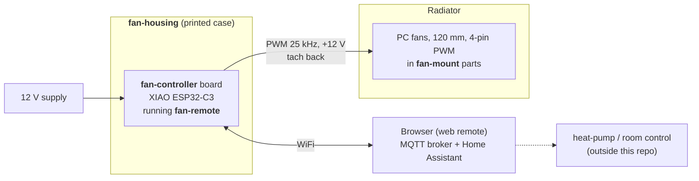

<p align="center"></p>

# joba-fans — quiet, networked fans for radiators

A small system that puts **PC fans on top of panel radiators** and controls them over WiFi. Its job is
to make a heat pump that cools through wall-hung radiators work properly: a low-mounted radiator hardly
emits any cooling power by free convection, so the heat pump short-cycles. Forced air over the fins
recovers a factor of roughly 3–4 (reasoning and sizing: [fan-mount/docs/requirements.md](fan-mount/docs/requirements.md)).

Four parts, each in its own directory with its own README:

| Part | What it is | Technology |
|---|---|---|
| [`fan-controller/`](fan-controller/) | The board: four PWM fan channels with tach read-back on a socketed ESP32 module | KiCad 10, Python generators |
| [`fan-housing/`](fan-housing/) | A snap-fit 3D-printed case for that board | OpenSCAD |
| [`fan-remote/`](fan-remote/) | The firmware: web remote, MQTT, Home Assistant discovery, soft start | PlatformIO / Arduino-ESP32 |
| [`fan-mount/`](fan-mount/) | 3D-printed mounts that hold 120 mm fans on the radiators | FreeCAD, STL |

## How it fits together



* A **radiator** carries up to ~9 fans in `fan-mount` parts. The fans are standard 120 × 25 mm PC fans.
* Each **controller board** drives four channels; several fans can share a channel (same speed, one tach).
  A 12 V supply feeds the board, which passes 12 V on to the fans.
* The **firmware** gives each board a web page, MQTT topics and a Home Assistant device. Speeds are set
  there — by hand, or by automation (for instance a heat-pump cooling signal in Home Assistant). The
  temperature logic is deliberately *not* part of this repo; the firmware only exposes the fans.
* The **housing** protects the board and brings the barrel jack, USB-C port and four fan cables out.

### The interfaces, and how each was checked

| Interface | Contract | Checked |
|---|---|---|
| firmware ↔ board | FAN1–4: PWM on D1/D3/D7/D6, tach on D2/D4/D10/D5 (GPIO 3/5/20/21 and 4/6/10/7) | The pin table in `fan-remote/src/Fans.cpp` equals the pad nets read out of `fan-controller.kicad_pcb`; the firmware builds for the XIAO ESP32-C3 and C6 and its 22 unit tests pass |
| board ↔ fans | 4-pin PC fan, pinout GND / +12 V / tach / PWM, 25 kHz PWM, 3.3 V logic | Pinout equals the PCB nets of J2–J5; 25 kHz is what the firmware generates. Total current of all fans must stay below the 1.5 A polyfuse |
| board ↔ housing | outer dimensions, connector positions, USB-C end, jack overhang | `fan-housing/board_params.scad` is regenerated from the PCB and is identical; `check_fit.py` passes (latch strain 1.5 %, ≥ 2.2 mm of air above every part, no tab hits a component); the STLs match the OpenSCAD source; the USB-C cut-out sits at the module's USB end (the module's pad rows run along the board's short side, with D6/D7 and the antenna at the other end) |
| fans ↔ mounts | 120 mm fan, 25 mm thick, 105 mm hole pattern | Collar inside 120.6 mm, rest height 2 mm, collar 28 mm; STL sizes match the spreadsheet dimensions (226.6 × 126.6 × 28 mm) |
| firmware ↔ Home Assistant | MQTT discovery, topics `fan-control/<id>/…` | Tested on a bench board with HA (see `fan-remote/docs/test.md`) |
| housing ↔ mounts | none (they only meet through the fans and cables) | — |

Fitting the parts together turned up four things worth knowing; all are written down in the component
READMEs:

1. The fan headers on the board are **unshrouded** — a reversed connector puts 12 V on a tach line
   ([fan-controller](fan-controller/README.md#known-issues)).
2. The PWM lines **float during an ESP reset**, so fans can burst briefly (also fan-controller; a pull-down
   is a candidate for board revision 2).
3. A radiator needs **more fans than a board has channels**, so fans must be chained per channel
   ([fan-mount](fan-mount/README.md#how-it-fits-the-rest-of-the-system)); this has not been tried yet.
4. The firmware has not yet run **on the real board** — only on a bench XIAO with one fan.

## Building it

1. **Board.** Order from the files in [`fan-controller/fab/`](fan-controller/fab/) (a PCB service that does
   assembly; revision 1 went to PCBWay), or regenerate them with `fan-controller/scripts/make_fab.sh`.
   Plug a XIAO ESP32-C3 into the sockets.
2. **Case.** Print the three STLs from [`fan-housing/stl/`](fan-housing/stl/) (PETG, no supports).
3. **Mounts.** Pick the variant for your radiator in [`fan-mount/cad/`](fan-mount/cad/) (the radiator
   sheet geometry is in [`fan-mount/docs/measurements.md`](fan-mount/docs/measurements.md)) and print it in
   PETG. Measure your own radiator first if it differs from the three documented ones.
4. **Firmware.** Register the board and flash it over USB-C, then set WiFi and the MQTT broker in the
   board's setup portal — see [`fan-remote/README.md`](fan-remote/README.md).
5. **Assemble.** Fans into the mounts and onto the radiator, fan cables into the board's headers (check
   that pin 1 = GND), board into the case, 12 V in.

## Repository layout

```text
fan-controller/   KiCad project, generator scripts, fab/ (fabrication package), docs/ (build log)
fan-housing/      OpenSCAD case, STLs, fit check
fan-remote/       PlatformIO firmware, tests, docs/ (spec, user, admin, test)
fan-mount/        FreeCAD models, STLs, scripts, docs/ (requirements, measurements, design notes)
assets/           logo (the fan symbol, also used as favicon) and social-preview image
LICENSE           CC BY-SA 4.0
```

Naming: the directories are named by role. The firmware names itself `fan-control-N` on the network (host
name, MQTT topics, Home Assistant ids) — that is the *device* identity, kept stable for boards that are
already installed, and is not the directory name.

## History and versions

Earlier, the board, the radiator mounts and the firmware lived in separate places. The commit history of
all of them is preserved here, now under the new directory names (messages are left in the language they were
written in, mostly German in the mounts' early history). Commit hashes changed in the merge, so documents
refer to **tags** instead:

| Tag | Meaning |
|---|---|
| `fan-controller-v1` | the board layout that was ordered (schematic and PCB unchanged since) |
| `fan-remote-v0.1.0` | firmware 0.1.0 (the firmware's build info is derived from `fan-remote-v*` tags) |

## Language and licence

Documentation and code comments are in English. Exceptions: the firmware's web page is bilingual
(German/English, by browser language), and the FreeCAD spreadsheets in `fan-mount/cad/` use German parameter
names (glossary in [fan-mount/docs/design-notes.md](fan-mount/docs/design-notes.md)).

[CC BY-SA 4.0](LICENSE). The XIAO symbol and footprints in `fan-controller/libraries/` come from Seeed
Studio's OPL_Kicad_Library, also CC BY-SA 4.0. The firmware pulls in third-party libraries through
PlatformIO under their own licences.
