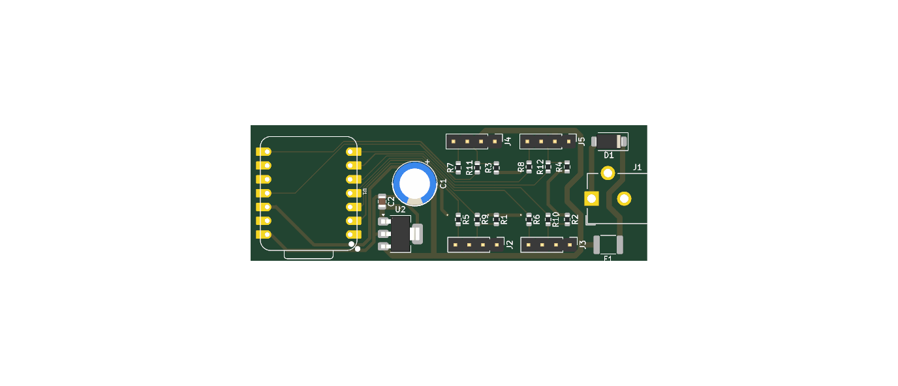
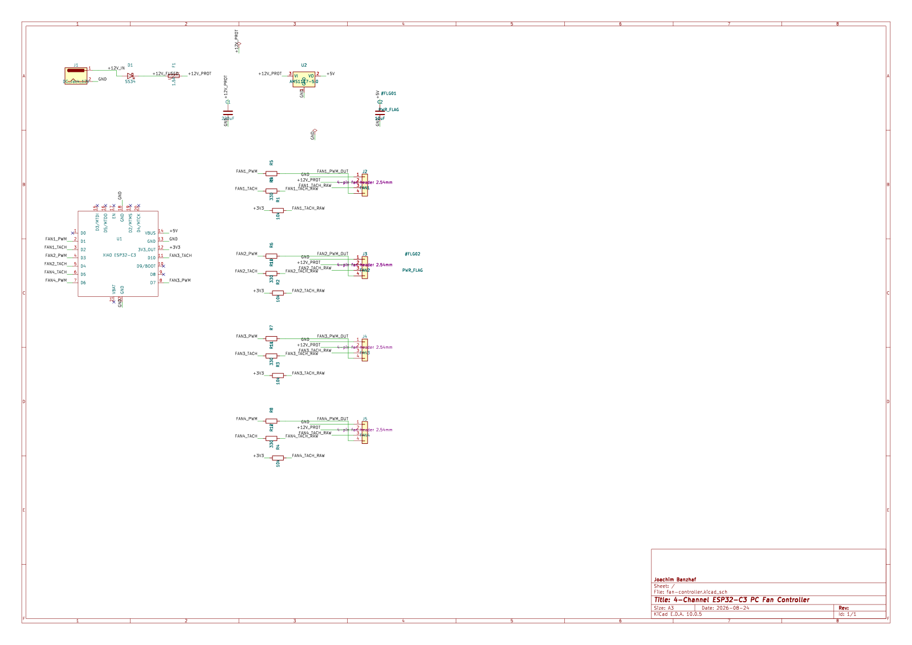

# fan-controller — 4-channel PWM fan controller board

A small two-layer board that drives **four 4-pin PC fans** (25 kHz PWM, tach read-back) from a socketed
**Seeed XIAO ESP32-C3**. 12 V in through a barrel jack, 72.9 × 25.0 mm. It is the electronics of the
[joba-fans](../README.md) project; the firmware that runs on it is [`fan-remote`](../fan-remote/), the case
is [`fan-housing`](../fan-housing/), and the fans sit in the [`fan-mount`](../fan-mount/) parts.



**Status:** revision 1 (git tag `fan-controller-v1`) was ordered from PCBWay, 10 boards, fully assembled
except for the XIAO module (the story is in the [build log](docs/build-log.html)). The firmware has so far
been tested on a bench XIAO with one fan, not yet on this board — see
[`fan-remote/docs/test.md`](../fan-remote/docs/test.md).

## Circuit

Per channel the PWM goes through 1 kΩ to the fan, and the tach signal comes back through 330 Ω to the ESP,
with a 10 kΩ pull-up to 3V3. Supply is a barrel jack, an SS34 diode as reverse-polarity protection, a 1.5 A
polyfuse and an AMS1117-5.0 for the ESP (which also provides the 3V3 for the tach pull-ups). The XIAO module
is **socketed** (two 1×7 female headers), not soldered.



### Pin assignment (verified against the PCB)

| Fan | Header | PWM (XIAO pin → GPIO) | Tach (XIAO pin → GPIO) |
|---|---|---|---|
| FAN1 | J2 | D1 → GPIO3 | D2 → GPIO4 |
| FAN2 | J3 | D3 → GPIO5 | D4 → GPIO6 |
| FAN3 | J4 | D7 → GPIO20 | D10 → GPIO10 |
| FAN4 | J5 | D6 → GPIO21 | D5 → GPIO7 |

D0, D8 and D9 are left free — strapping pins of the ESP32-C3 (D8 is suggested for an optional LED, see
[`fan-housing`](../fan-housing/README.md#about-the-led)). The firmware uses exactly this table
(`fan-remote/src/Fans.cpp`); both were checked against the pad nets of the `.kicad_pcb`.

Fan connector pinout (standard PC 4-pin): **1 = GND, 2 = +12 V, 3 = tach, 4 = PWM**.

| Part | Value |
|---|---|
| J1 | DC barrel jack 5.5 × 2.1 mm, 12 V, overhangs the board edge on purpose |
| D1 | SS34, reverse-polarity protection |
| F1 | 1.5 A polyfuse (1812), shared by all four fans and the regulator |
| U2 | AMS1117-5.0 for the XIAO's VBUS pin |
| C1 / C2 | 220 µF electrolytic (leaded, 3.5 mm pitch) / 10 µF 0805 |
| R1–R4 / R5–R8 / R9–R12 | 10 kΩ tach pull-up / 1 kΩ PWM series / 330 Ω tach series |
| J2–J5 | fan headers, 1×4, 2.54 mm |
| U1 | XIAO ESP32-C3 on two 1×7 female headers (the XIAO ESP32-C6 is pin-compatible) |

## Files

| Path | Content |
|---|---|
| `fan-controller.kicad_pro/_sch/_pcb` | the KiCad 10 project (open the `.kicad_pro`) |
| `libraries/` | XIAO symbol and footprints, vendored (see its README for the licence) |
| `scripts/` | Python tools: the schematic is **generated** from `netplan.py` by `generate.py`, the fab files by `make_fab.sh` |
| `fab/` | fabrication package: BOM and pick-and-place for JLCPCB and PCBWay, ordering notes, [fab/README.md](fab/README.md) |
| `docs/build-log.html` | the project page: from the discarded 555 sketch to the order (open in a browser; self-contained) |
| `docs/img/` | renderings of the schematic and the board |

## Working with the project

Regenerate the schematic from the net plan (also checks the exported netlist against the plan — ERC alone
does not find a wire that ends on the wrong pin):

```sh
python3 fan-controller/scripts/generate.py fan-controller/fan-controller.kicad_sch
```

Regenerate the fabrication data (needs `kicad-cli`; gerbers, drill, BOM and CPL in JLCPCB and PCBWay formats,
packed into `fab/fan-controller-fab.zip`):

```sh
fan-controller/scripts/make_fab.sh
```

Checked when this repository was assembled with KiCad 10: ERC 0 violations, DRC 0 violations and 0
unconnected pads; the generator reproduces the schematic (apart from random UUIDs) with all 22 nets matching
the plan; `make_fab.sh` reproduces the tracked BOM and CPL byte for byte.

Ordering: [fab/ORDERING.md](fab/ORDERING.md) (options and decision), [fab/ROTATION-WARNING.md](fab/ROTATION-WARNING.md)
(check D1 and U2 in the assembly preview), [fab/THT-ORDER-LIST.md](fab/THT-ORDER-LIST.md) (parts to source
yourself when the fab does not fit the through-hole parts).

## Known issues

* **The fan headers are unshrouded and unpolarised.** A fan connector plugged in the wrong way round puts
  +12 V on the tach net (header pin 3), which goes through only 330 Ω to an ESP32 GPIO. Check the orientation
  (pin 1 = GND) every time, or fit shrouded/keyed headers when building more boards.
* **The PWM lines have no pull-down.** While the ESP resets (power-up, OTA reboot, watchdog) the pins float and
  a fan's own pull-up asks for full speed — a short burst of up to a few tenths of a second. The firmware
  drives the pins low first thing; fixing it fully would take a 10 kΩ pull-down per line (board revision 2).
* **Total current:** the single 1.5 A polyfuse protects all four fan headers together. Add up the nameplate
  currents of the fans on a board (at most 2 fans per header, 8 per board; see
  [`fan-mount`](../fan-mount/README.md#how-it-fits-the-rest-of-the-system)) and stay below that.
* **Jack and USB-C together:** the XIAO's VBUS pin is fed from the AMS1117; whether the module isolates its
  own USB 5 V from that pin has not been verified here. Flash over USB with the 12 V jack unplugged, or use
  the over-the-air update.
