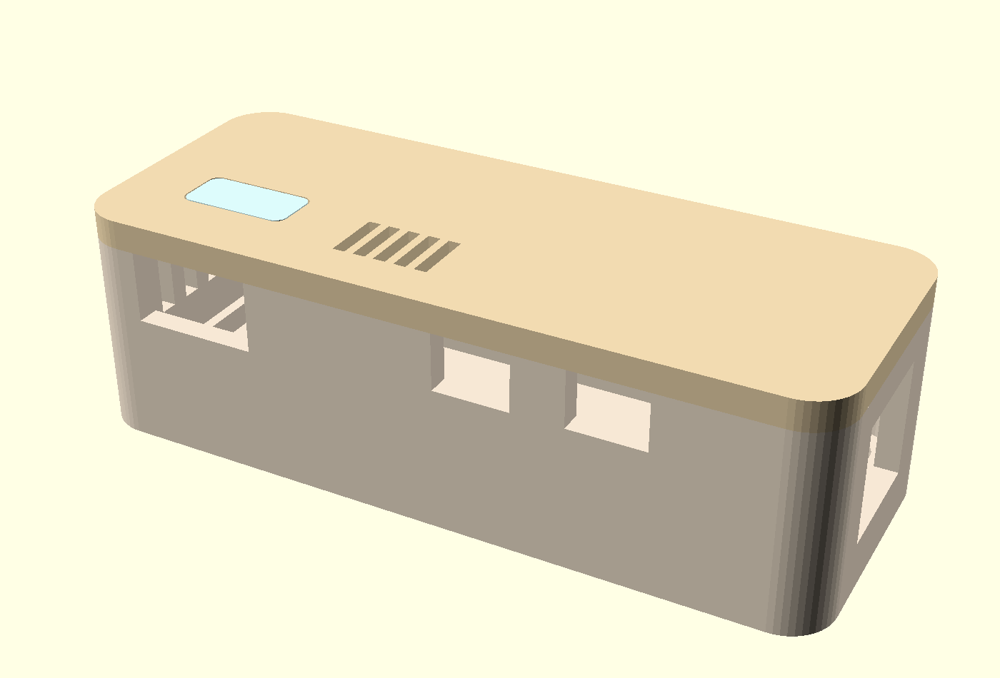
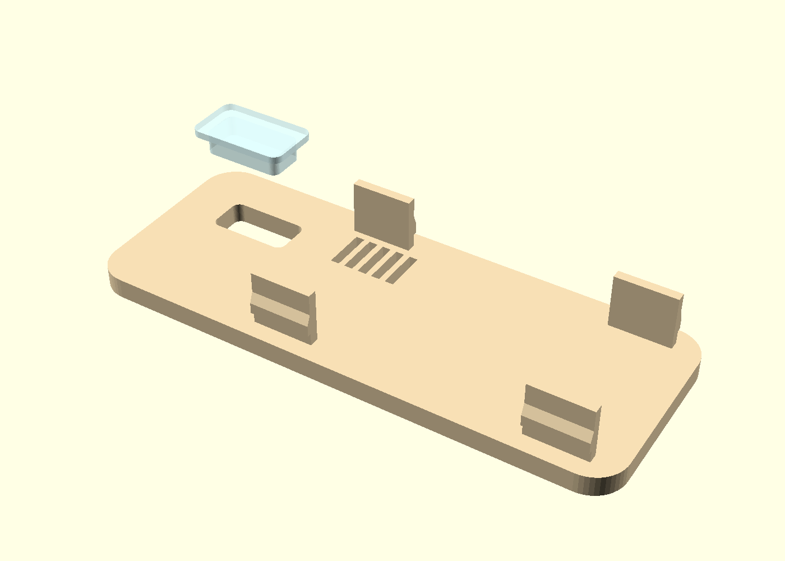
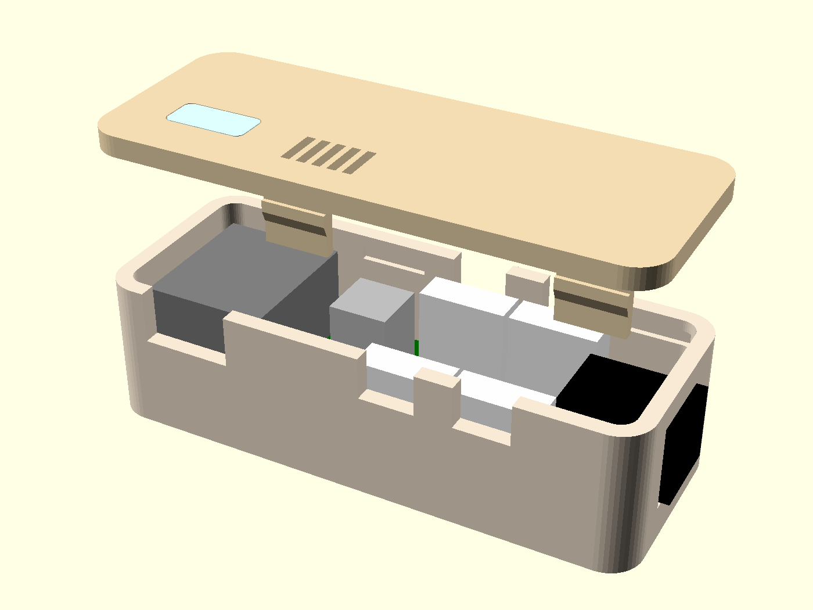
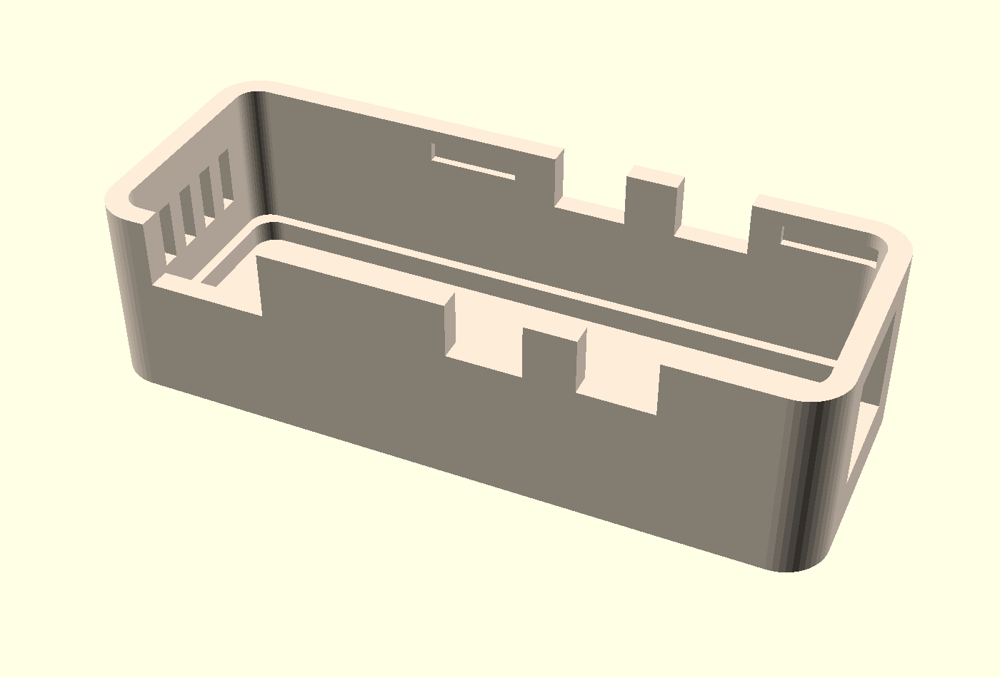

# fan-housing — case for the 4-channel fan controller

A snap-fit case for the [`fan-controller`](../fan-controller/) board, no screws. Outer size
**78.3 × 30.4 × 24.2 mm**, parametric in OpenSCAD.



At the front the two cable slots for FAN1 and FAN2 and, to the left of them, the USB-C cut-out; at the
right the barrel jack; on top the light window and the vent slots above the voltage regulator. The other
two cable slots are mirrored on the back.

Generated from `fan-housing.scad`; all board dimensions come from `board_params.scad`, which
`extract_geometry.py` pulls out of the `.kicad_pcb`. The board is ordered and its dimensions are fixed —
only the case changes from here on.

## Parts

| File | Material | Position on the bed |
|---|---|---|
| `stl/fan-housing-tray.stl` | cream PETG | as exported, floor down |
| `stl/fan-housing-lid.stl` | cream PETG | as exported, visible face down, tabs up |
| `stl/fan-housing-guide.stl` | transparent PETG | as exported |



The lid in print orientation — upside down, the four spring tabs pointing up. The latch nose can be seen
as a step on the two front ones; the chamfer below it pushes the tab in by itself when the lid is put on.

The light guide is shown lifted off and is **printed separately** — transparent, while the lid stays
cream. It is inserted from the inside of the lid, in this upside-down position from above. Its collar then
rests against the underside of the lid and keeps it from falling out.

All three are already exported in print orientation and need **no supports**. The lid lies upside down so
the visible face comes smoothly off the bed and the latch tabs point up.

Recommendation: 0.2 mm layers, 4 perimeters. The four perimeters are not cosmetic — the spring tabs are
1.4 mm thick and should consist of perimeters, not infill.

## Assembly



1. Press the light guide into the lid opening from the **inside**. The collar holds it against the
   underside of the lid; it sits tight, but a drop of glue on the collar does no harm.
2. Put the board into the tray from above; it rests on the surrounding shoulder. 2.5 mm remain under it for
   the solder joints.
3. Plug in the fan connectors and lay the cables into the slots of the long walls. The slots are open at
   the top so that you lay the cables in instead of threading them — the connector does not fit through a
   closed hole.
4. Press the lid on until the four noses click in. To open, press the long walls outward a little at the
   latch points (at X 27.5 and 67 mm).

## Openings



Inside, the support shoulder for the board runs all around; below it 2.5 mm remain for the solder joints.
At the top of the long walls sit the four latch pockets as shallow recesses — they only mill into the wall,
a through-cut would be visible from outside. On the left the vent slots.

* **Barrel jack:** right end wall. It overhangs the board edge anyway and so sticks out of the wall.
* **Four cable slots**, 8 mm wide each, above the fan connectors in the long walls. The lid closes them at
  the top; the cable is then captive.
* **USB-C** in the lower long wall, for re-flashing without opening. Can be switched off with
  `usb_opening = false`.
* **Vent slots** in the left end wall and in the lid above the AMS1117. At a 12 V input it dissipates about
  0.7 W; in a tight box this size that becomes noticeable. Can be switched off with `vents = false`.
* **Light window** in the lid above the XIAO — see below.

## Dimension chains on layer boundaries

The lid is **3.1 mm** thick, not 3.0. The reason is not visual but about printing: with a 0.3 mm first layer
and 0.2 mm layers after that, the layer boundaries are at 0.3 / 0.5 / … / 2.9 / 3.1. A top edge at 3.0 falls
in the **middle** of a layer.

This only becomes apparent where two parts meet there: the collar of the light guide begins at the inside of
the lid, and at 3.0 mm the top of the lid and the underside of the collar claim the same layer at the same
place. The slicer then aborts with `found slicing result conflict` although the geometry is clean.

It was found on the printed part: the window sat one layer too far back on the inside. With 3.1 mm the
dividing plane lies on a layer boundary and the collar can be printed along.

**Rule of thumb:** where two parts in one print meet, the dividing plane must lie on a layer boundary.
Otherwise they compete for the same layer.

## About the LED

The XIAO ESP32-C3 has **no usable LED**: neither a power nor a user LED. The only LED on the module is the
charge indicator next to the USB-C socket, and it only lights when a LiPo is charging on the BAT pads. Our
board has no battery and no LED of its own. The window therefore stays dark unless something is retrofitted.
(The firmware does not drive an LED either.)

Retrofitting takes two components. The strapping pins D0 (pin 1), D8 (pin 9) and D9 (pin 10) are free — they
were deliberately left unconnected. **D8** is the right choice:

```text
3V3 (pin 12) --- 330 ohm --- LED --->|--- D8 (pin 9)
```

The LED lights when the firmware pulls D8 LOW. GPIO8 has to be HIGH during boot — in this circuit the LED is
then off, and the resistor to 3V3 additionally acts as a weak pull-up. The other way round (LED to GND)
would disturb booting.

Pins 9 and 12 are both in the left socket strip, 7.6 mm apart. The LED itself goes on top of the XIAO module
with two thin wires, under the window. 330 ohm are lying around anyway — it is the value of R9 to R12.

If you do not want that, set `light_window = false` and get a closed lid.

## Why the lid is 3 mm thick

The walls are 2.4 mm, the lid 3.1 mm. Cream PETG is still slightly translucent at 2.4 mm; an LED directly
underneath shows as a blotch. At 3 mm all is calm, and the light exits only where it should — through the
transparent light guide.

## Check before printing

The board dimensions are exact, the **component heights are catalogue values**: female header 8.5 mm, XIAO
board 1.0 mm, USB-C socket 3.3 mm, fan connector 12.0 mm (a figure supplied by the owner), electrolytic cap
12.5 mm. That gives 15 mm of inner height with a margin of 2.2 mm above the tallest part.

If you can measure the socketed XIAO beforehand: adjust `h_socket`, `h_xiao_pcb` and `h_usbc` in
`fan-housing.scad`, run `check_fit.py` and export again.

## Changing and checking

```sh
python3 fan-housing/extract_geometry.py   # after a change to the board (needs KiCad's pcbnew module)
python3 fan-housing/check_fit.py          # check the fits numerically (needs openscad)
fan-housing/export_stl.sh                 # regenerate the three STLs
```

`check_fit.py` checks what a render does not show: whether the latch nose hits its pocket, whether the
spring tab withstands the deflection (outer-fibre strain below 3 %, PETG yields from about 4 %), whether a
tab pokes into a component, and whether every component fits under the lid. Two errors have already
accumulated here that were not visible in the picture: a latch pocket that cut through the wall, and a nose
that sat 2 mm below its pocket. The model works out its cuboids itself and prints them via `echo()` so that
the dimensions do not live in two places.

Verified when this repository was assembled: `board_params.scad` is identical to what the current PCB
produces, `check_fit.py` passes all checks, and the three STLs match the OpenSCAD source (same bounding box
and volume).

For viewing: `part = "all"` shows the assembly with indicated components, `part = "explode"` with the lid
lifted off, `part = "closed"` the closed case, `part = "lid_guide"` the lid in print orientation with the
light guide lifted off. `part = "latch"` cuts a 5 mm thick slice across one latch and puts it at the origin
— for judging the engagement in the OpenSCAD GUI, where you can rotate freely. As a still image that is of
little use: from the inside the tab hides exactly the pocket, and the view from outside needs the CGAL
renderer, which ignores `color()`.

The pictures in `img/` are made in preview mode (without `--render`), otherwise all parts are one flat
yellow:

```sh
openscad -o img/fan-housing-assembled.png --imgsize=1400,950 \
         --camera=36.4,12.5,8,60,0,28,168 -D 'part="closed"' fan-housing.scad
```
