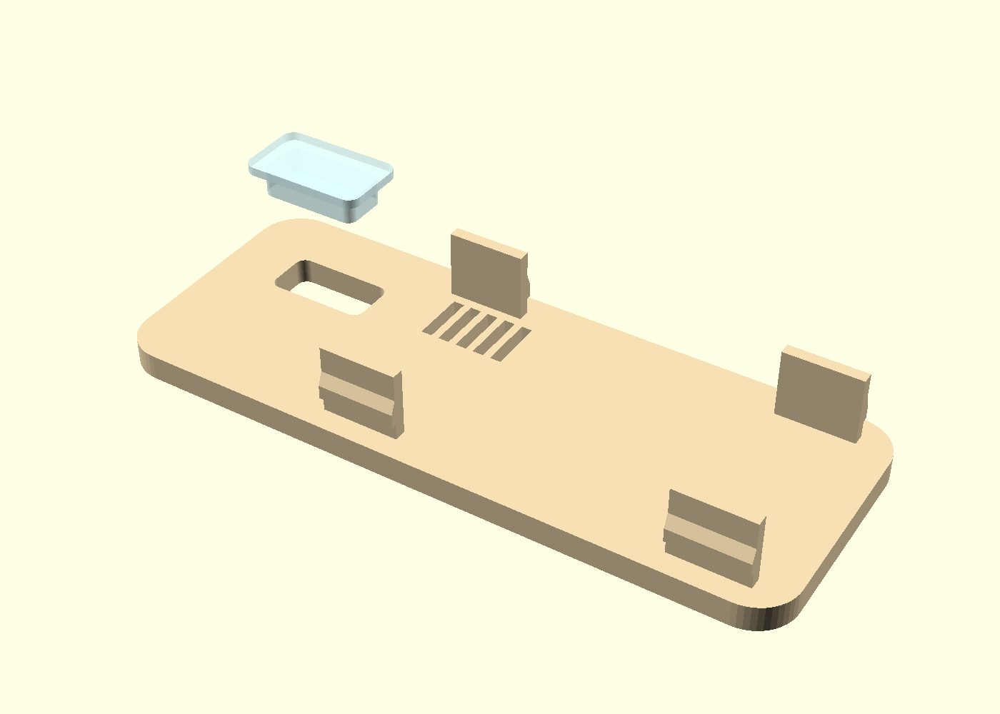
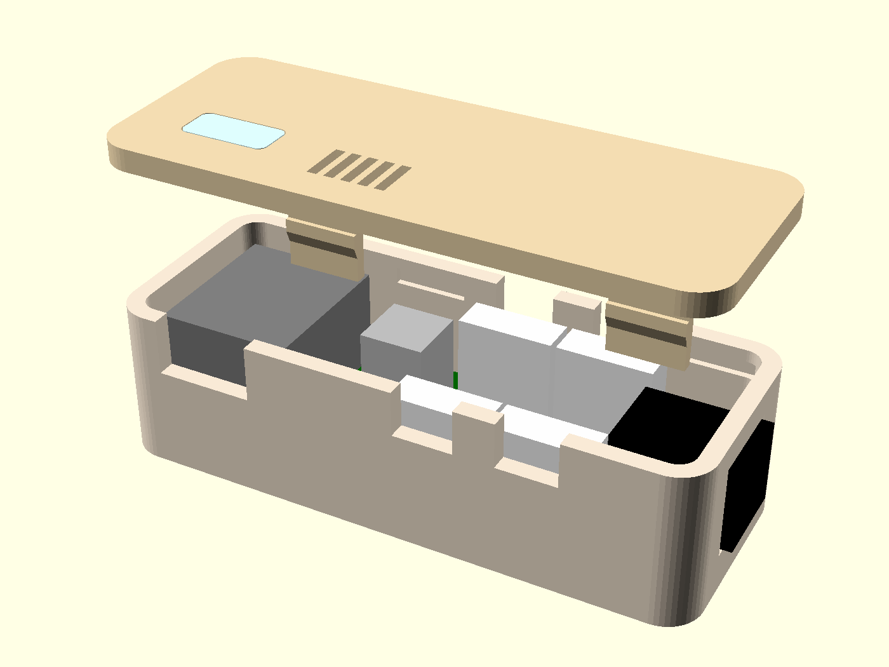
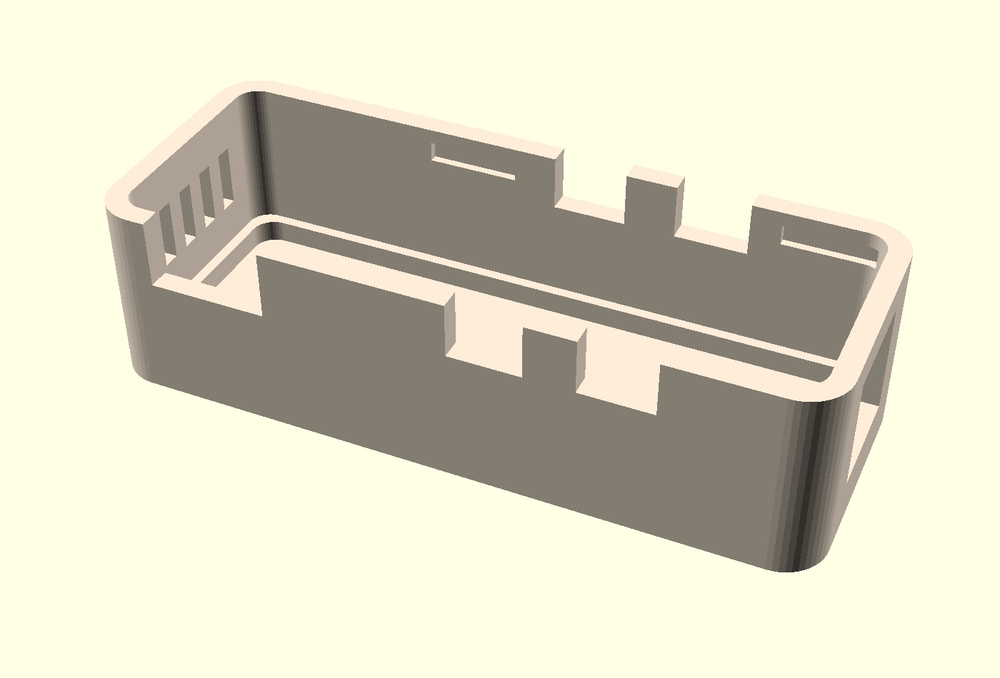

# Gehaeuse fuer den 4-Kanal-Luefterregler

Zum Zusammenstecken, ohne Schrauben. Aussenmass **78,3 x 30,4 x 24,1 mm**.


Vorne die beiden Kabelschlitze fuer FAN1 und FAN2 und links daneben der
USB-C-Ausschnitt, rechts die Hohlbuchse, oben das Lichtfenster und die
Lueftungsschlitze ueber dem Spannungsregler. Die zweiten beiden
Kabelschlitze liegen spiegelbildlich auf der Rueckseite.

Erzeugt aus `case.scad`; alle Platinenmasse stammen aus
`board_params.scad`, das `extract_geometry.py` aus der `.kicad_pcb` zieht.
Die Platine ist bestellt, ihre Masse stehen also fest — geaendert wird hier
nur noch das Gehaeuse.

## Teile

| Datei | Material | Lage auf dem Bett |
|---|---|---|
| `stl/fan-controller-case-tray.stl` | cremefarbenes PETG | wie exportiert, Boden unten |
| `stl/fan-controller-case-lid.stl` | cremefarbenes PETG | wie exportiert, Deckelflaeche unten, Zungen nach oben |
| `stl/fan-controller-case-guide.stl` | transparentes PETG | wie exportiert |



Der Deckel in Drucklage — kopfueber, die vier Federzungen zeigen nach oben.
An den beiden vorderen ist die Rastnase als Stufe zu erkennen; die
Anschraegung darunter druckt die Zunge beim Aufsetzen von selbst ein.

Der Lichtleiter ist abgehoben dargestellt und wird **getrennt gedruckt** —
transparent, waehrend der Deckel cremefarben bleibt. Eingesetzt wird er von
der Innenseite des Deckels, in dieser umgedrehten Lage also von oben. Sein
Bund liegt danach an der Deckelunterseite an und haelt ihn gegen
Herausfallen nach aussen.

Alle drei sind bereits in Drucklage exportiert und brauchen **keine
Stuetzen**. Der Deckel liegt kopfueber, damit die Sichtflaeche glatt vom
Druckbett kommt und die Rastzungen nach oben zeigen.

Empfehlung: 0,2 mm Schichthoehe, 4 Perimeter. Die vier Perimeter sind
nicht Kosmetik — die Federzungen sind 1,4 mm dick und sollen aus
Perimetern bestehen, nicht aus Infill.

## Zusammenbau



1. Lichtleiter von **innen** in die Deckeloeffnung druecken. Der Bund haelt
   ihn gegen die Deckelunterseite; er sitzt stramm, ein Tropfen Kleber am
   Bund schadet aber nicht.
2. Platine von oben in die Wanne legen, sie sitzt auf der umlaufenden
   Schulter auf. Unter ihr bleiben 2,5 mm fuer die Loetstellen.
3. Luefterkabel stecken und die Kabel in die Schlitze der Laengswaende
   legen. Die Schlitze sind nach oben offen, damit man die Kabel einlegen
   statt einfaedeln kann — durch ein geschlossenes Loch passt der Stecker
   nicht.
4. Deckel aufdruecken, bis die vier Nasen einrasten. Zum Oeffnen die
   Laengswaende an den Rastpunkten (bei X 27,5 und 67 mm) leicht nach
   aussen druecken.

## Oeffnungen



Innen laeuft die Auflageschulter fuer die Platine um; darunter bleiben
2,5 mm fuer die Loetstellen. Oben in den Laengswaenden sitzen die vier
Rasttaschen als flache Mulden — sie fraesen die Wand nur an, ein
Durchbruch waere von aussen sichtbar. Links die Lueftungsschlitze.

* **Hohlbuchse** rechte Stirnwand. Sie steht ohnehin ueber die
  Platinenkante hinaus und schaut damit aus der Wand.
* **Vier Kabelschlitze**, je 8 mm breit, ueber den Lueftersteckern in den
  Laengswaenden. Der Deckel schliesst sie oben, das Kabel ist danach
  gefangen.
* **USB-C** in der unteren Laengswand, zum Nachflashen ohne Oeffnen. Ueber
  `usb_opening = false` abschaltbar.
* **Lueftungsschlitze** in der linken Stirnwand und im Deckel ueber dem
  AMS1117. Der verheizt bei 12 V Eingang rund 0,7 W; in einer dichten
  Schachtel dieser Groesse wird das spuerbar warm. Ueber `vents = false`
  abschaltbar.
* **Lichtfenster** im Deckel ueber dem XIAO — siehe unten.

## Massketten auf Schichtgrenzen legen

Der Deckel ist **3,1 mm** dick, nicht 3,0. Der Grund ist nicht optisch,
sondern drucktechnisch: bei 0,3 mm erster Schicht und 0,2 mm danach liegen
die Schichtgrenzen bei 0,3 / 0,5 / ... / 2,9 / 3,1. Eine Oberkante bei
3,0 faellt **mitten** in eine Schicht.

Das faellt erst auf, wenn zwei Teile dort aneinanderstossen: der Bund des
Lichtleiters beginnt an der Deckelinnenseite, und bei 3,0 mm beanspruchen
Deckeloberkante und Bundunterkante dieselbe Schicht am selben Ort. Der
Slicer bricht dann mit `found slicing result conflict` ab, obwohl die
Geometrie sauber ist.

Erkannt wurde es am gedruckten Teil: das Fenster sass von der Innenseite
her eine Schicht zurueck. Mit 3,1 mm liegt die Trennebene auf einer
Schichtgrenze, und der Bund laesst sich mitdrucken.

**Merksatz:** wo zwei Teile in einem Druck aneinanderstossen, muss die
Trennebene auf einer Schichtgrenze liegen. Sonst konkurrieren sie um
dieselbe Schicht.

## Zur LED

Der XIAO ESP32-C3 hat **keine nutzbare LED**: weder Power- noch User-LED.
Die einzige LED auf dem Modul ist die Ladeanzeige neben der USB-C-Buchse,
und die leuchtet nur, wenn ein LiPo an den BAT-Pads laedt. Unsere Platine
hat keinen Akku und selbst auch keine LED. Das Fenster bleibt also dunkel,
solange nichts nachgeruestet wird.

Nachruesten geht mit zwei Bauteilen. Frei sind die Strapping-Pins D0
(Pin 1), D8 (Pin 9) und D9 (Pin 10) — sie wurden bewusst nicht beschaltet.
**D8** ist die richtige Wahl:

```text
3V3 (Pin 12) --- 330 Ohm --- LED --->|--- D8 (Pin 9)
```

Die LED leuchtet, wenn die Firmware D8 auf LOW zieht. Beim Booten muss
GPIO8 HIGH sein — in dieser Beschaltung ist die LED dann aus, und der
Widerstand gegen 3V3 wirkt zusaetzlich als schwacher Pull-up. Andersherum
(LED gegen GND) wuerde der Bootvorgang gestoert.

Pin 9 und Pin 12 liegen beide in der linken Buchsenleiste, 7,6 mm
auseinander. Die LED selbst kommt mit zwei duennen Draehten oben auf das
XIAO-Modul, unter das Fenster. 330 Ohm liegen ohnehin herum — es ist der
Wert von R9 bis R12.

Wer das nicht will, setzt `light_window = false` und bekommt einen
geschlossenen Deckel.

## Warum der Deckel 3 mm dick ist

Die Waende sind 2,4 mm, der Deckel 3,0 mm. Cremefarbenes PETG ist bei
2,4 mm noch leicht transluzent; eine LED direkt darunter zeichnet sich als
Fleck ab. Mit 3 mm ist Ruhe, und das Licht tritt nur dort aus, wo es soll —
durch den transparenten Lichtleiter.

## Vor dem Druck pruefen

Die Platinenmasse sind exakt, die **Bauteilhoehen sind Katalogwerte**:
Buchsenleiste 8,5 mm, XIAO-Platine 1,0 mm, USB-C-Buchse 3,3 mm,
Luefterstecker 12,0 mm (deine Angabe), Elko 12,5 mm. Daraus folgen 15 mm
Innenhoehe mit 2,2 mm Reserve ueber dem hoechsten Teil.

Wenn du den gesockelten XIAO vorher messen kannst: `h_socket`, `h_xiao_pcb`
und `h_usbc` in `case.scad` anpassen, `check_fit.py` laufen lassen, neu
exportieren.

## Aendern und pruefen

```sh
python3 enclosure/extract_geometry.py     # nach Aenderung an der Platine
python3 enclosure/check_fit.py            # Passungen rechnerisch pruefen
openscad -o stl/fan-controller-case-tray.stl -D 'part="tray"' enclosure/case.scad
```

`check_fit.py` prueft, was ein Render nicht zeigt: ob die Rastnase ihre
Tasche trifft, ob die Federzunge die Auslenkung elastisch aushaelt
(Randfaserdehnung unter 3 %, PETG fliesst ab etwa 4 %), ob eine Zunge in
ein Bauteil ragt und ob jedes Bauteil unter den Deckel passt. Zwei Fehler
sind hier schon aufgelaufen, die auf dem Bild nicht zu sehen waren: eine
Rasttasche, die die Wand durchschlug, und eine Nase, die 2 mm unter ihrer
Tasche sass. Das Modell rechnet seine Quader selbst aus und gibt sie per
`echo()` aus, damit die Masse nicht an zwei Stellen stehen.

Zum Ansehen: `part = "all"` zeigt den Zusammenbau mit angedeuteter
Bestueckung, `part = "explode"` mit abgehobenem Deckel, `part = "closed"`
das geschlossene Gehaeuse, `part = "lid_guide"` den Deckel in Drucklage mit
abgehobenem Lichtleiter. `part = "latch"` schneidet eine 5 mm dicke
Scheibe quer durch eine Rastung heraus und legt sie in den Ursprung — zum
Beurteilen des Eingriffs in der OpenSCAD-Oberflaeche, wo man frei drehen
kann. Als Standbild taugt das wenig: von innen verdeckt die Zunge genau
die Tasche, und der Blick von aussen braucht den CGAL-Renderer, der
`color()` ignoriert.

Die Bilder in `img/` entstehen im Preview-Modus (ohne `--render`), sonst
sind alle Teile einfarbig gelb:

```sh
openscad -o img/case-assembled.png --imgsize=1400,950 \
         --camera=36.4,12.5,8,60,0,28,168 -D 'part="closed"' case.scad
```
